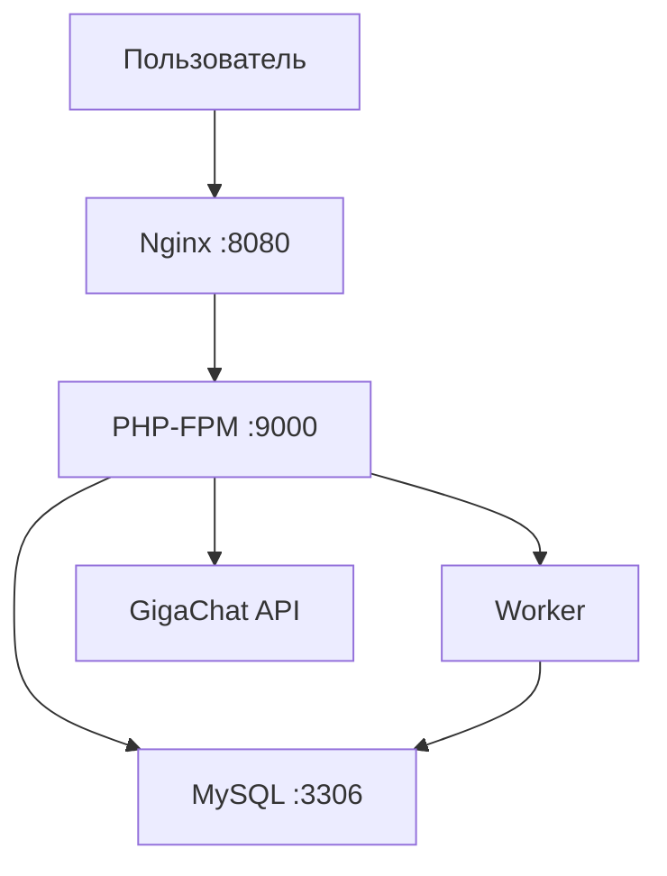

# Backend-сервис лендинга с AI-интеграцией

<div align="center">

**Тестовое задание: бэкенд-сервис для лендинг-презентации разработчика с полноценной API-частью и интеграцией AI-инструментов**

</div>

---

## 📖 О проекте

Это веб-приложение на Laravel, реализующее бэкенд-сервис для лендинг-презентации. Сервис предоставляет API для формы обратной связи с интеграцией AI-инструментов для анализа тональности комментариев, асинхронной отправкой уведомлений и полным логированием всех запросов.

### 🎯 Ключевые возможности

- 📝 **API для работы с обращениями** — создание лидов через `POST /api/contact`, просмотр всех лидов через `GET /api/metric`
- 🤖 **AI-интеграция** — анализ тональности комментариев через GigaChat
- 📧 **Email-уведомления** — письма владельцу сайта и пользователю
- 🛡️ **Rate Limiting** — защита от спама (количество запросов в минуту)
- 📊 **Статистика** — сбор и хранение аналитики по обращениям
- 🔄 **Асинхронность** — обработка AI-анализа через очереди
- 📋 **Логирование** — все запросы логируются в БД
- 🏥 **Health Check** — эндпоинт `GET /api/health` для мониторинга
- 📚 **Swagger/OpenAPI** — полная документация API
- 🧪 **Тестирование** — покрытие PHPUnit тестами
- 🌍 **Локализация** — поддержка русского и английского языков

### 🏗️ Технологический стек

| Компонент | Технология | Версия |
|-----------|------------|--------|
| Backend | Laravel | 12 |
| Язык | PHP | 8.3 |
| База данных | MySQL | 9.3 |
| AI-провайдер | GigaChat | — |
| Очереди | Laravel worker | — |
| Веб-сервер | Nginx | Latest |
| Контейнеризация | Docker | 24.0+ |
| Документация | Swagger/OpenAPI | 3.0 |
| Тестирование | PHPUnit | 11+ |

---

## 🚀 Установка и запуск

### 📋 Системные требования

- Docker 24.0+
- Docker Compose 2.20+
- Git
- 2 ГБ свободной оперативной памяти

### 📦 Быстрый старт

```bash
# 1. Клонирование репозитория
git clone https://github.com/Marvel-81/inet-labs-test.git
cd inet-labs-test

# 2. Запуск контейнеров
docker-compose up -d --build

# 3. Установка зависимостей
docker exec -it inet-lab-php composer install

# 4. Настройка переменных окружения
cp www/.env.example www/.env
# Отредактируйте .env файл: настройте GIGACHAT_API_KEY и параметры почты

# 5. Перезапуск контейнеров
docker-compose restart

# 6. Приложение доступно
```

### 🐳 Docker-инфраструктура

Проект использует многоконтейнерную архитектуру:



| Сервис | Контейнер | Порт | Назначение |
|--------|-----------|------|------------|
| **PHP** | `inet-lab-php` | - | Основное приложение Laravel |
| **Nginx** | `inet-lab-nginx` | `8080:80` | Веб-сервер |
| **MySQL** | `inet-lab-mysql` | `3306:3306` | База данных |
| **Worker** | `inet-lab-worker` | - | Обработка очередей (Supervisor) |

---

## 🔧 Настройка переменных окружения

### `.env` пример

```env
фAPP_NAME=Laravel
APP_ENV=local
APP_KEY=
APP_DEBUG=true
APP_TIMEZONE=Europe/Moscow
APP_URL=http://localhost:8080
APP_LOCALE=ru
APP_FALLBACK_LOCALE=ru
APP_FAKER_LOCALE=en_US
APP_MAINTENANCE_STORE=database

SESSION_LIFETIME=120
PHP_CLI_SERVER_WORKERS=4
BCRYPT_ROUNDS=12

LOG_CHANNEL=stack
LOG_STACK=single
LOG_DEPRECATIONS_CHANNEL=null
LOG_LEVEL=debug

DB_CONNECTION=mysql
DB_HOST=mysql
DB_PORT=3306
DB_DATABASE=tempbase
DB_USERNAME=tempbase
DB_PASSWORD=tempbase

SESSION_DRIVER=database
SESSION_LIFETIME=120
SESSION_ENCRYPT=false
SESSION_PATH=/
SESSION_DOMAIN=null

BROADCAST_CONNECTION=log
FILESYSTEM_DISK=local
QUEUE_CONNECTION=database

CACHE_STORE=file
CACHE_PREFIX=

L5_SWAGGER_CONST_HOST=http://localhost:8080
L5_SWAGGER_OPEN_API_SPEC_VERSION=3.0.0

GIGACHAT_CERT_PATH=false

RATE_LIMIT_CONTACT_PER_MINUTE=5

MAIL_MAILER=log
MAIL_HOST=127.0.0.1
MAIL_PORT=2525
MAIL_USERNAME=null
MAIL_PASSWORD=null
MAIL_ENCRYPTION=null
MAIL_FROM_ADDRESS="hello@example.com"
MAIL_FROM_NAME="${APP_NAME}"

GIGACHAT_AUTH_KEY=""
```

---

## 📊 Архитектура проекта

### Структура каталогов

```
app/
├── Http/
│   ├── Controllers/       # Контроллеры (API)
│   │   ├── Api/
│   │   │   ├── LeadController.php
│   │   │   └── HealthCheckController.php
│   ├── Resources/        # Ресурсы для стандартизации ответов
│   │   ├── ErrorResource.php
│   │   ├── LeadCollectionResource.php
│   │   ├── LeadAiAnalysisResource.php
│   │   ├── LeadResource.php
│   │   └── SuccessResource.php
│   └── Requests/          # Form Requests (валидация)
│       └── LeadRequest.php
├── Jobs/                  # Jobs (асинхронные задачи)
│   └── AnalyzeToneJob.php
├── Notifications/         # Генерация уведомлений (асинхронные задачи)
│   ├── AnalyzeToneJob.php
│   └── SendLeadNotifications.php
├── Models/                # Модели
│   ├── Lead.php
│   └── LeadAiAnalysis.php
├── Observers/             # Observers
│   └── LeadObserver.php
├── Services/              # Сервисы (бизнес-логика)
│   ├── LeadService.php
│   ├── AIService.php
│   ├── LeadAICommentService.php
│   ├── HealthCheckService.php
│   └── AI/
│       └── GigaChatService.php
├── Interfaces/            # Интерфейсы
│   └── AIServiceInterface.php
├── Providers/             # Провайдеры
│   └── AppServiceProvider.php
└── Swagger/               # Классы описания
│   ├── LeadsPathAnnotation.php
│   ├── HealthPathAnnotation.php
│   ├── SchemasAnnotation.php
    └── OpenApiSpec.php

resources/
├── lang/                  # Локализация
│   ├── ru/
│   │   └── messages.php
│   └── en/
│       └── messages.php
└── views/
    └── emails/            # Шаблоны писем
        ├── admin/
        │   └── new-lead.blade.php
        └── lead/
            └── confirmation.blade.php

routes/
└── api.php                # API маршруты

database/
├── factories/             # Фабрики
│   ├── LeadFactory.php
└── migrations/            # Миграции
    ├── create_leads_table.php
    └── create_lead_ai_analyses_table.php

tests/
├── Feature/               # Интеграционные тесты
│   ├── HealthCheckTest.php
│   ├── LeadApiTest.php
│   └── LeadValidatorTest.php
└── Unit/                  # Юнит тесты
    └── LeadTest.php
```

## Архитектурные паттерны

### 🏗️ Используемые паттерны проектирования

| Паттерн | Описание | Использование |
|---------|----------|---------------|
| **Message Queue** | Асинхронная обработка задач | AI-анализ, отправка email |
| **Data Transfer Object (DTO)** | Передача данных между слоями | Request, Resources, сервисы |
| **Service Layer** | Бизнес-логика | LeadService, AIService |
| **Observer** | Реакция на события | LeadObserver |
| **Repository (Active Record)** | Работа с данными | Eloquent модели |
| **Factory** | Создание объектов | LeadFactory |
| **Singleton** | Единственный экземпляр | DI |
| **Strategy** | Взаимозаменяемые алгоритмы | AIServiceInterface |
| **Chain of Responsibility** | Обработка запросов | Middleware |
| **MVC** | Архитектура приложения | Controllers, Models, Views |

---

## 🔌 API Эндпоинты

### 📋 POST /api/contact

Создание нового обращения (лида).

**Тело запроса:**
```json
{
  "name": "Иван Петров",
  "phone": "+7 (999) 123-45-67",
  "email": "ivan@example.com",
  "comment": "Хочу заказать разработку сайта"
}
```

**Успешный ответ (201):**
```json
{
  "success": true,
  "message": "Заявка успешно создана",
  "data": {
    "id": 1,
    "name": "Иван Петров",
    "phone": "+7 (999) 123-45-67",
    "email": "ivan@example.com",
    "comment": "Хочу заказать разработку сайта",
    "created_at": "2026-07-17T10:30:00.000000Z",
    "formatted_date": "17.07.2026 10:30"
  }
}
```

**Ошибка валидации (422):**
```json
{
  "success": false,
  "message": "Ошибка валидации данных",
  "errors": {
    "name": ["Поле \"Имя\" обязательно для заполнения."],
    "email": ["Введите корректный email адрес."]
  },
  "error_code": "VALIDATION_ERROR"
}
```

**Превышение лимита запросов (429):**

### 📊 GET /api/leads

Получение списка всех лидов с AI-аналитикой.

**Ответ:**
```json
{
  "success": true,
  "message": "Список лидов получен успешно",
  "data": {
    "data": [
      {
        "id": 1,
        "name": "Иван Петров",
        "phone": "+7 (999) 123-45-67",
        "email": "ivan@example.com",
        "comment": "Хочу заказать разработку сайта",
        "created_at": "2026-07-17T10:30:00.000000Z",
        "formatted_date": "17.07.2026 10:30",
        "ai_analysis": [
          {
            "id": 1,
            "parameter": "Тональность",
            "decoded_value": "позитивная",
            "confidence": "0.85",
            "created_at": "2026-07-17T10:30:05.000000Z"
          }
        ]
      }
    ],
    "meta": {
      "total": 1
    }
  }
}
```

### 🏥 GET /api/health

Проверка статуса сервиса.

**Ответ:**
```json
{
  "success": true,
  "message": "Приложение работает корректно",
  "data": {
    "status": "ok",
    "timestamp": "2026-07-17T10:30:00.000000Z",
    "environment": "local",
    "checks": {
      "database": {
        "status": "ok",
        "message": "Database connection successful"
      },
      "cache": {
        "status": "ok",
        "message": "Cache connection successful"
      },
      "app": {
        "status": "ok",
        "environment": "local",
        "debug": true,
        "timezone": "UTC"
      }
    }
  }
}
```
---

## 🤖 AI-интеграция

### GigaChat — анализ тональности

**Использование:** Анализ тональности комментария пользователя.
- tigusigalpa/gigachat-php

### Graceful Fallback

Если AI-сервис недоступен:
- Сервис продолжает работать
- В лог записывается ошибка
- Возвращается значение по умолчанию: `"Тональность не проанализирована"`

---

## 📧 Email-уведомления

### Письмо администратору

- Отправляется автоматически при создании лида
- Содержит все данные пользователя
- Использует шаблон `emails/admin/new-lead.blade.php`

### Письмо пользователю (подтверждение)

- Отправляется копия письма пользователю
- Содержит подтверждение получения заявки
- Использует шаблон `emails/lead/confirmation.blade.php`

---

## 📊 Хранение данных

### Логирование

Все запросы логируются в `storage/logs/laravel.log`:

### Статистика

Статистика обращений хранится в базе данных MySQL:
- `leads` — основные данные
- `lead_ai_analyses` — результаты AI-анализа

---

## 🧪 Тестирование

### Запуск тестов

```bash
# Все тесты
docker exec -it inet-lab-php php artisan test

# Unit тесты
docker exec -it inet-lab-php php artisan test --testsuite=Unit

# Feature тесты
docker exec -it inet-lab-php php artisan test --testsuite=Feature

# Конкретный тест
docker exec -it inet-lab-php php artisan test --filter LeadTest
docker exec -it inet-lab-php php artisan test --filter HealthCheckTest
```

---

## 🛠️ Что сделано с помощью AI

| Компонент | Использование AI | Компонент |
|-----------|------------------|-----------|
| **Миграции** | Генерация сервиса | "Составь миграцию ларавель для таблицы ... с полями ..." |
| **Шаблоны** | Генерация шблонов писем | "Составь blade шаблоны для писем-уведомлений автору сайта и лиду, используя данные из таблицы" |
| **LeadRquest** | Генерация реквеста | "Сделай реквест для проверки входных данных, согласно таблице ..." |
| **Ресурсы** | Генерация  ресурсов | "Сделай ресурс ларавель для такого ответа ..." |
| **Тесты** | Генерация тестов | "Сделай фьюча/юнит тесты для проверки функцонала ..." |
| **GigaChatService** | Интеграция с GigaChat | "Покажи пример интеграции с GigaChat API" |
| **HealthCheckService** | Проверка статуса | "Реализуй health check сервис" |
| **Локализация** | Перевод сообщений | "Сделай локализацию для русского/английского для" |
| **Readme.md** | Структурирование текста | "Оформи этот md ..." |

### Что пришлось исправлять вручную

- В большей или меньшей степени всё. Минимально миграции, шаблоны, ресурсы, хэлсчек сервис

---

## 📞 Контакты

- **Разработчик**: Alexey V. Smirnov
- **Email**: sd-programmer@yandex.ru
- **GitHub**: https://github.com/Marvel-81

---

## 📚 Дополнительная документация

### Swagger/OpenAPI

Документация API доступна после разворачивания проекта, по адресу:
```
http://localhost:8080/api/documentation
```

### Postman коллекция

https://martian-zodiac-585605.postman.co/workspace/My-Workspace~bdc5ac36-aa19-448b-85df-56d175f9bdf8/collection/29280525-e81fc55a-4b00-4def-a815-ffedaaa4f964?action=share&creator=29280525

---
